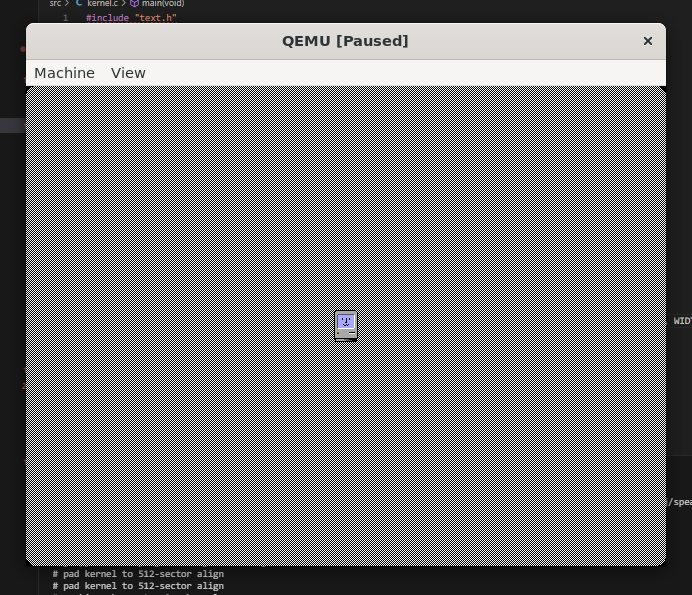
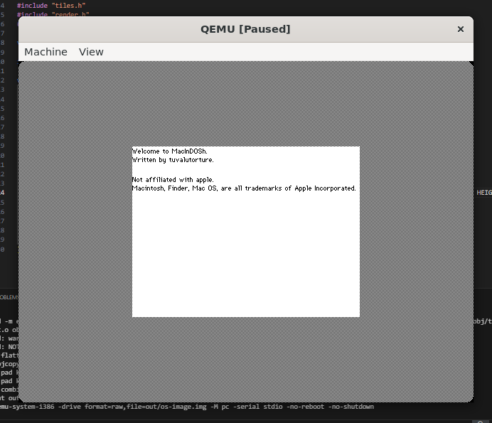
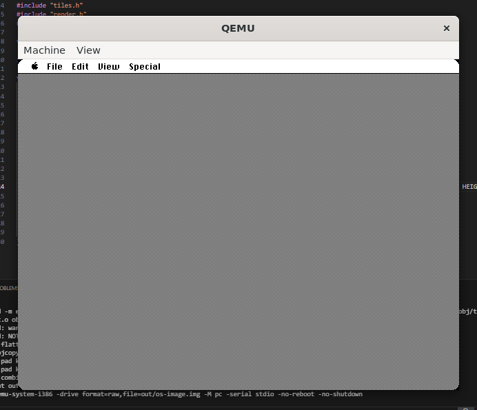

# What is MacInDOSh?

MacInDOSh (Macintosh Inside DOS) is an open source recreation of the Macintosh System Softwares 1-6 intended for x86 based machines. 

In its current state, it CAN boot to desktop, though not much else, as currently we have yet to reimplement KB/m controls. 

Colour IS "supported", but is currently commented out in code to allow for more performance and authenticity (it can be re-enabled, however, and works out of the box.) If re-enabling colour, you will also need to go into ```stage2.asm``` and change line 69 from ```mov ax, 0x0011``` (VGA mode 640x480x1) to ```mov ax, 0x0012``` (VGA mode 640x480x4bpp).

# Req's

boots on any x86 cpu, needs 1mb of ram, a fdd, and any competent VGA card 

QEMU is recommended to run it, as it is currently the only confirmed emulator able to run it. QEMU is included in the dependencies, and ```make run``` automatically launches it through qemu-system-i386.

If you do not have a VGA card and only have EGA (or are looking for a more authentic resolution to the Macintosh, which is 512x342x1), you can also change it to ```mov ax, 0x000f``` (EGA mode 640x350x1) for a similar resolution. You would also need to modify the ```HEIGHT``` and ```WIDTH``` defines in ```video.c```

# Building

To build, run ```bash install-packages.sh``` (because dependencies ofc), then run ```make run```.

# Licensing & Credits

written and maintained by tuvalutorture

licensed under gpl v3, contributions welcome :D

### Not affiliated with Apple, Inc.

Macintosh, Finder, Mac OS, are all trademarks of Apple Incorporated.

also apple i swear to fucking god if you DMCA this repo i will personally resurrect steve jobs and personally smash a NeXT cube in front of his eyes just to spite you

### Screenshots


